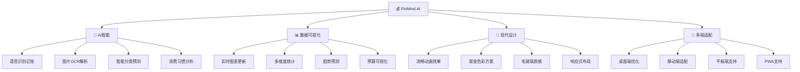
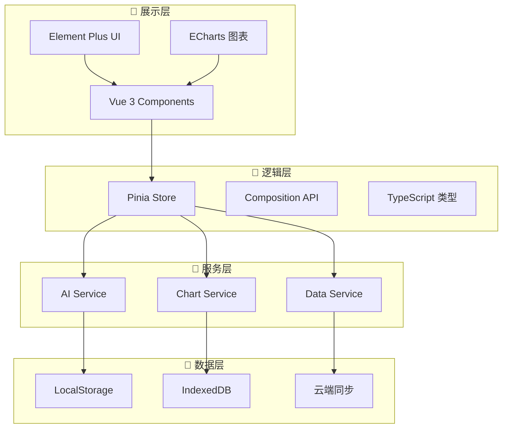

# 💰 FinMind AI

<div align="center">


**🧠 智能理财 · 🎯 精准预算 · 📊 可视分析 · 🤖 AI助手**

[](https://vuejs.org/)
[](https://www.typescriptlang.org/)
[](https://element-plus.org/)
[](https://pinia.vuejs.org/)
[](https://echarts.apache.org/)


</div>

---

## ✨ 项目简介

**FinMind AI** 是一款革命性的智能记账应用，融合了人工智能、数据可视化和现代化用户体验。通过多模态交互（语音、图片、文字），让记账变得简单有趣，让理财变得智能高效。

### 🎭 为什么选择 FinMind AI？



---

## 🚀 核心功能

<table>
  <tr>
    <td align="center" width="50%">
      
      <h3>🏠 智能首页</h3>
      <p>一目了然的今日概览，实时预算状态，动态图表展示</p>
    </td>
    <td align="center" width="50%">
      
      <h3>🤖 AI智能对话</h3>
      <p>语音、图片、文字多模态交互，让记账如聊天般简单</p>
    </td>
  </tr>
  <tr>
    <td align="center" width="50%">
      
      <h3>📊 数据看板</h3>
      <p>丰富的图表类型，饼图、曲线图、柱状图应有尽有</p>
    </td>
    <td align="center" width="50%">
      
      <h3>📈 统计分析</h3>
      <p>月度年度趋势分析，消费习惯深度洞察</p>
    </td>
  </tr>
</table>

### 🎯 特色功能一览

| 功能模块       | 描述                         | 技术亮点                     |
| -------------- | ---------------------------- | ---------------------------- |
| 🏠 **智能首页** | 今日账单、预算状态、图表预览 | 实时数据更新、响应式卡片布局 |
| 🤖 **AI对话**   | 语音/图片/文字多模态交互记账 | 语音识别、OCR解析、NLP处理   |
| 📊 **数据看板** | 饼图、曲线图、柱状图可视化   | ECharts动态图表、自适应布局  |
| 📈 **统计分析** | 月度/年度消费趋势分析        | 数据挖掘、趋势预测算法       |
| 📥 **账单导入** | 支持CSV、Excel、PDF、图片    | 多格式解析、批量处理         |
| 👤 **个人中心** | 用户资料、账号绑定管理       | 安全认证、数据同步           |
| ⚙️ **智能设置** | 预算配置、通知提醒、Bot集成  | 个性化配置、第三方集成       |

---

## 🛠 技术架构

### 前端技术栈

```typescript
// 核心框架
Vue 3.3.4          // 渐进式框架，Composition API
TypeScript 5.1.6   // 类型安全，开发体验
Pinia 2.1.6        // 状态管理，模块化设计

// UI & 样式
Element Plus 2.3.8 // 企业级组件库
Sass               // CSS预处理器
响应式设计          // 移动端适配

// 数据可视化
ECharts 5.4.3      // 专业图表库
动态图表           // 实时数据更新

// 路由 & 工具
Vue Router 4.2.4   // 单页应用路由
Axios 1.4.0        // HTTP客户端
Dayjs 1.11.9       // 轻量级时间库
```

### 系统架构图



---

## 📦 快速开始

### 环境要求

- **Node.js** >= 16.0.0
- **npm** >= 8.0.0 或 **yarn** >= 1.22.0
- **现代浏览器** (Chrome 90+, Firefox 88+, Safari 14+)

### 🚀 一键启动

```bash
# 📥 克隆项目
git clone https://github.com/your-username/FinMind-ai.git
cd FinMind-ai

# 📦 安装依赖
npm install
# 或者使用 yarn
yarn install

# 🔥 启动开发服务器
npm run serve
# 或者
yarn serve

# 🌐 打开浏览器访问
# http://localhost:8080
```

### 🏗 构建部署

```bash
# 🔨 构建生产版本
npm run build

# 📊 分析打包体积
npm run build --report

# 🚀 预览生产版本
npm run preview
```

---

## 📁 项目结构

```
FinMind-ai/
├── 📁 public/                 # 静态资源
├── 📁 src/
│   ├── 📁 components/         # 🧩 通用组件
│   │   ├── PageHeader.vue     # 页面头部
│   │   ├── StatCard.vue       # 统计卡片
│   │   └── ChartContainer.vue # 图表容器
│   ├── 📁 layout/             # 🏗 布局组件
│   │   ├── Index.vue          # 主布局
│   │   └── components/        # 布局子组件
│   ├── 📁 views/              # 📄 页面组件
│   │   ├── 🏠 Home/           # 首页模块
│   │   ├── 🤖 Chat/           # AI对话模块
│   │   ├── 📊 Dashboard/      # 数据看板模块
│   │   ├── 📈 Statistics/     # 统计分析模块
│   │   ├── 📥 Import/         # 账单导入模块
│   │   ├── 👤 Profile/        # 个人信息模块
│   │   └── ⚙️ Settings/       # 应用设置模块
│   ├── 📁 stores/             # 🗄 Pinia状态管理
│   │   ├── transaction.ts     # 交易数据
│   │   ├── user.ts           # 用户信息
│   │   └── chat.ts           # 聊天记录
│   ├── 📁 services/           # 🔗 服务层
│   │   └── ai.ts             # AI服务
│   ├── 📁 types/              # 📝 TypeScript类型
│   ├── 📁 styles/             # 🎨 样式文件
│   │   ├── variables.scss     # SCSS变量
│   │   └── index.scss        # 全局样式
│   ├── 📁 router/             # 🛣 路由配置
│   └── main.ts               # 应用入口
├── 📄 package.json           # 项目配置
├── 📄 tsconfig.json          # TS配置
├── 📄 vue.config.js          # Vue配置
└── 📄 README.md              # 项目文档
```

---

## 🎨 设计理念

### 🌈 色彩方案

```css
/* 主色调 - 科技蓝紫渐变 */
--primary-gradient: linear-gradient(135deg, #667eea 0%, #764ba2 100%);

/* 辅助色调 */
--pink-gradient: linear-gradient(135deg, #f093fb 0%, #f5576c 100%);
--orange-gradient: linear-gradient(135deg, #ff6b6b, #ee5a24);
--blue-gradient: linear-gradient(135deg, #4facfe 0%, #00f2fe 100%);
--green-gradient: linear-gradient(135deg, #43e97b 0%, #38f9d7 100%);

/* 功能色彩 */
--success: #67c23a;
--warning: #e6a23c;
--danger: #f56c6c;
--info: #909399;
```

### ✨ 动画效果

- **🎭 页面切换**：淡入淡出过渡，流畅自然
- **📊 图表动画**：数据加载动画，视觉吸引
- **🃏 卡片悬停**：阴影变化，立体感提升
- **🎯 按钮交互**：缩放反馈，操作确认
- **💫 加载状态**：骨架屏，用户体验优化

---

## 🤖 AI 功能详解

### 🎤 语音识别记账

```typescript
// 语音转文字，智能提取消费信息
const voiceToTransaction = async (audioBlob: Blob) => {
  const text = await speechToText(audioBlob);
  const transaction = await extractTransactionInfo(text);
  return transaction;
};
```

### 📷 图片OCR解析

```typescript
// 拍照识别小票，自动录入账单
const imageToTransaction = async (imageFile: File) => {
  const ocrResult = await ocrService.recognize(imageFile);
  const structuredData = await parseReceiptData(ocrResult);
  return structuredData;
};
```

### 🧠 智能分类预测

```typescript
// 基于历史数据，预测消费分类
const predictCategory = (description: string, amount: number) => {
  const features = extractFeatures(description, amount);
  const category = aiModel.predict(features);
  return category;
};
```

---

## 📊 数据可视化展示

### 📈 图表类型

| 图表类型     | 用途         | 特点               |
| ------------ | ------------ | ------------------ |
| 🥧 **饼图**   | 支出分类占比 | 直观对比，色彩丰富 |
| 📈 **折线图** | 支出趋势变化 | 时间序列，趋势明显 |
| 📊 **柱状图** | 每日消费情况 | 数值对比，易于理解 |
| 🎯 **环形图** | 预算使用率   | 进度展示，一目了然 |
| 📉 **面积图** | 累计消费曲线 | 层次分明，数据丰富 |

### 🎨 图表配色

```javascript
const chartColors = [
  '#667eea', '#764ba2', '#f093fb', '#f5576c',
  '#4facfe', '#00f2fe', '#43e97b', '#38f9d7'
];
```

---

## 🔧 开发指南

### 🎯 添加新功能

1. **创建组件**
```bash
# 在对应模块下创建新组件
src/views/ModuleName/components/NewFeature.vue
```

2. **定义类型**
```typescript
// 在 types/index.ts 中添加类型定义
export interface NewFeatureType {
  id: string;
  name: string;
  // ...其他属性
}
```

3. **更新Store**
```typescript
// 在对应的 store 中添加状态和方法
export const useNewFeatureStore = defineStore('newFeature', () => {
  // 状态定义
  // 方法定义
  return { /* ... */ };
});
```

### 🎨 自定义主题

```scss
// 在 styles/variables.scss 中修改变量
$primary-color: #your-color;
$secondary-color: #your-secondary-color;

// 重新编译即可应用新主题
npm run serve
```

### 📱 响应式适配

```scss
// 使用预定义的断点
@media (max-width: 768px) {
  .your-component {
    // 移动端样式
  }
}

@media (max-width: 1024px) {
  .your-component {
    // 平板端样式
  }
}
```

---

## 🚀 部署方案

### 🌐 Vercel 部署

```bash
# 安装 Vercel CLI
npm i -g vercel

# 一键部署
vercel --prod
```

### 🐳 Docker 部署

```dockerfile
# Dockerfile
FROM node:16-alpine
WORKDIR /app
COPY package*.json ./
RUN npm ci --only=production
COPY . .
RUN npm run build
EXPOSE 8080
CMD ["npm", "run", "serve"]
```

### ☁️ 云服务器部署

```bash
# 构建项目
npm run build

# 上传 dist 文件夹到服务器
scp -r dist/ user@server:/var/www/FinMind-ai/

# 配置 Nginx
server {
    listen 80;
    server_name your-domain.com;
    root /var/www/FinMind-ai;
    index index.html;
    
    location / {
        try_files $uri $uri/ /index.html;
    }
}
```

---

## 🤝 贡献指南

### 🎯 如何贡献

1. **🍴 Fork** 项目到你的 GitHub
2. **🌿 创建** 特性分支 (`git checkout -b feature/AmazingFeature`)
3. **💻 提交** 你的修改 (`git commit -m 'Add some AmazingFeature'`)
4. **📤 推送** 到分支 (`git push origin feature/AmazingFeature`)
5. **🔀 开启** Pull Request

### 📝 提交规范

```bash
# 功能开发
git commit -m "feat: 添加语音识别功能"

# 问题修复
git commit -m "fix: 修复图表渲染问题"

# 样式调整
git commit -m "style: 优化移动端布局"

# 文档更新
git commit -m "docs: 更新API文档"
```

### 🧪 代码规范

- 使用 **TypeScript** 进行类型检查
- 遵循 **Vue 3** 最佳实践
- 使用 **ESLint** 进行代码检查
- 采用 **Prettier** 格式化代码

---

## 📈 性能优化

### ⚡ 加载优化

- **🔄 懒加载**: 路由组件按需加载
- **📦 代码分割**: Webpack 自动分包
- **🗜 资源压缩**: Gzip 压缩优化
- **🖼 图片优化**: WebP 格式支持

### 💾 缓存策略

- **🏪 localStorage**: 本地数据缓存
- **🗄 IndexedDB**: 大数据存储
- **☁️ Service Worker**: 离线缓存支持

### 📊 性能监控

```javascript
// 性能指标监控
const performanceObserver = new PerformanceObserver((list) => {
  const entries = list.getEntries();
  entries.forEach((entry) => {
    console.log(`${entry.name}: ${entry.duration}ms`);
  });
});

performanceObserver.observe({ entryTypes: ['measure', 'navigation'] });
```

---

## 🛡 安全性

### 🔐 数据安全

- **🔒 本地加密**: 敏感数据本地加密存储
- **🌐 HTTPS**: 全站 HTTPS 加密传输
- **🛡 XSS防护**: 输入验证和输出编码
- **🚫 CSRF防护**: Token 验证机制

### 👤 隐私保护

- **📵 离线优先**: 数据优先存储在本地
- **🎛 权限控制**: 用户自主控制数据共享
- **🗑 数据清理**: 支持一键清除所有数据
- **📋 隐私政策**: 透明的数据使用说明

---

## 📱 移动端支持

### 📲 PWA 特性

- **🏠 添加到主屏**: 类原生应用体验
- **📶 离线访问**: Service Worker 离线缓存
- **🔔 推送通知**: 预算提醒和消费提醒
- **⚡ 快速启动**: 应用壳缓存机制

### 📱 移动端优化

- **👆 触摸友好**: 大按钮设计，易于点击
- **📏 响应式布局**: 适配各种屏幕尺寸
- **⚡ 性能优化**: 移动端性能调优
- **🔋 省电模式**: 减少动画，延长续航

---

## 🔮 未来规划

### 🎯 短期目标 (v2.0)

- [ ] 🔄 **数据同步**: 多设备云端同步
- [ ] 👥 **家庭账本**: 多人协作记账
- [ ] 🎨 **主题定制**: 个性化主题切换
- [ ] 📱 **小程序版**: 微信小程序支持

### 🚀 中期目标 (v3.0)

- [ ] 🤖 **AI升级**: 更智能的消费建议
- [ ] 💰 **投资追踪**: 投资组合管理
- [ ] 📊 **高级分析**: 财务健康评分
- [ ] 🔗 **银行对接**: 银行账户自动同步

### 🌟 长期愿景 (v4.0+)

- [ ] 🏦 **理财规划**: AI理财顾问
- [ ] 🌍 **多币种**: 全球货币支持
- [ ] 🎓 **财商教育**: 理财知识学习
- [ ] 🤝 **开放平台**: 第三方插件生态

---

## 📞 联系我们

<div align="center">

### 🌟 给我们一个 Star 吧！

如果这个项目对你有帮助，请给我们一个 ⭐️

### 📬 联系方式

📧 **邮箱**: [contact@FinMind-ai.com](mailto:contact@FinMind-ai.com)  
💬 **微信群**: 扫码加入开发者交流群  
🐛 **问题反馈**: [GitHub Issues](https://github.com/your-username/FinMind-ai/issues)  
💡 **功能建议**: [GitHub Discussions](https://github.com/your-username/FinMind-ai/discussions)

### 🔗 相关链接

[](https://FinMind-ai.com)
[](https://demo.FinMind-ai.com)
[](https://docs.FinMind-ai.com)

</div>

---

## 📄 开源协议

本项目基于 [MIT License](LICENSE) 开源协议，你可以自由使用、修改和分发。

```
MIT License

Copyright (c) 2024 FinMind AI Team

Permission is hereby granted, free of charge, to any person obtaining a copy
of this software and associated documentation files (the "Software"), to deal
in the Software without restriction...
```

---

<div align="center">

### 🎉 感谢使用 FinMind AI！

**让智能理财，从今天开始** 💰🧠✨


---

**⭐ 如果喜欢这个项目，别忘了给我们一个 Star！ ⭐**

</div>